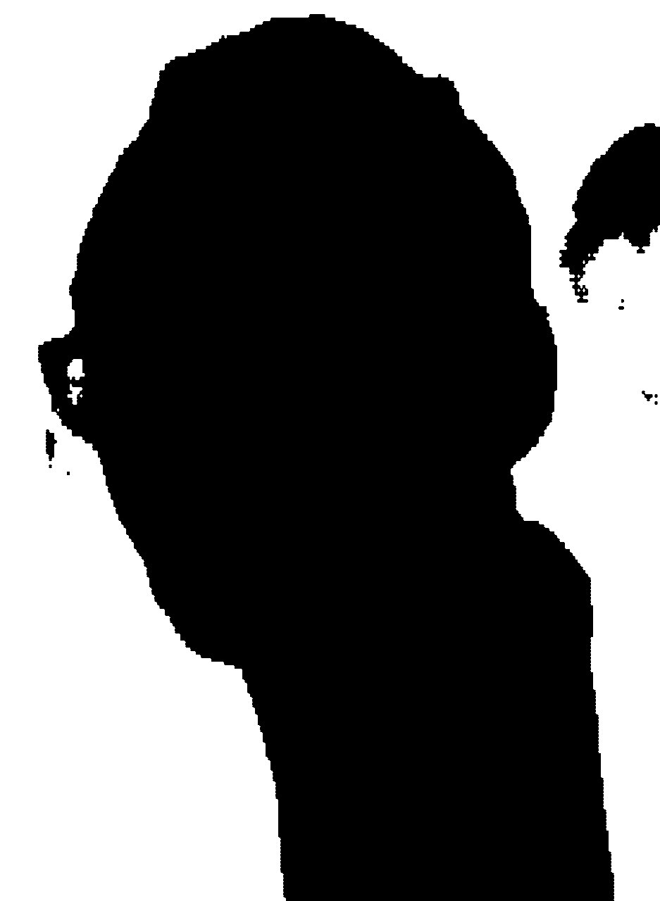
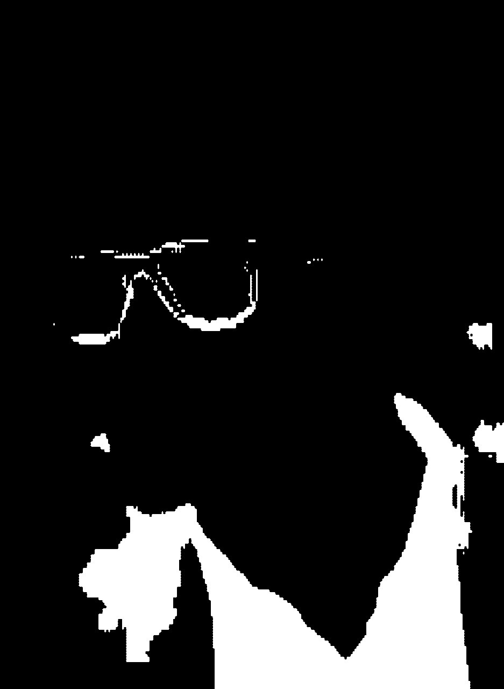
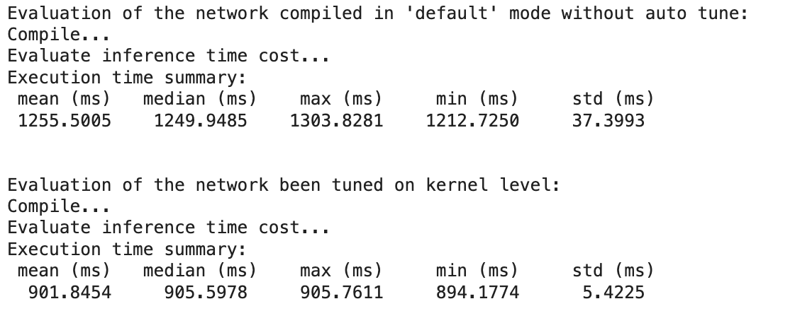
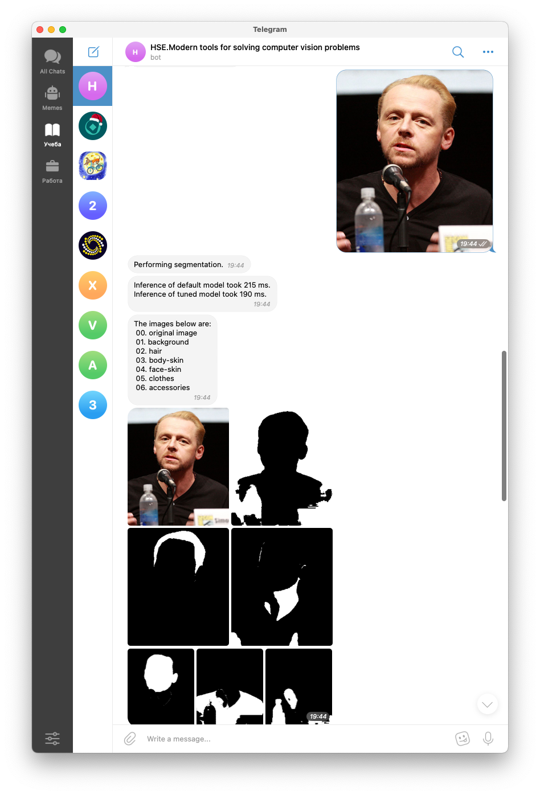
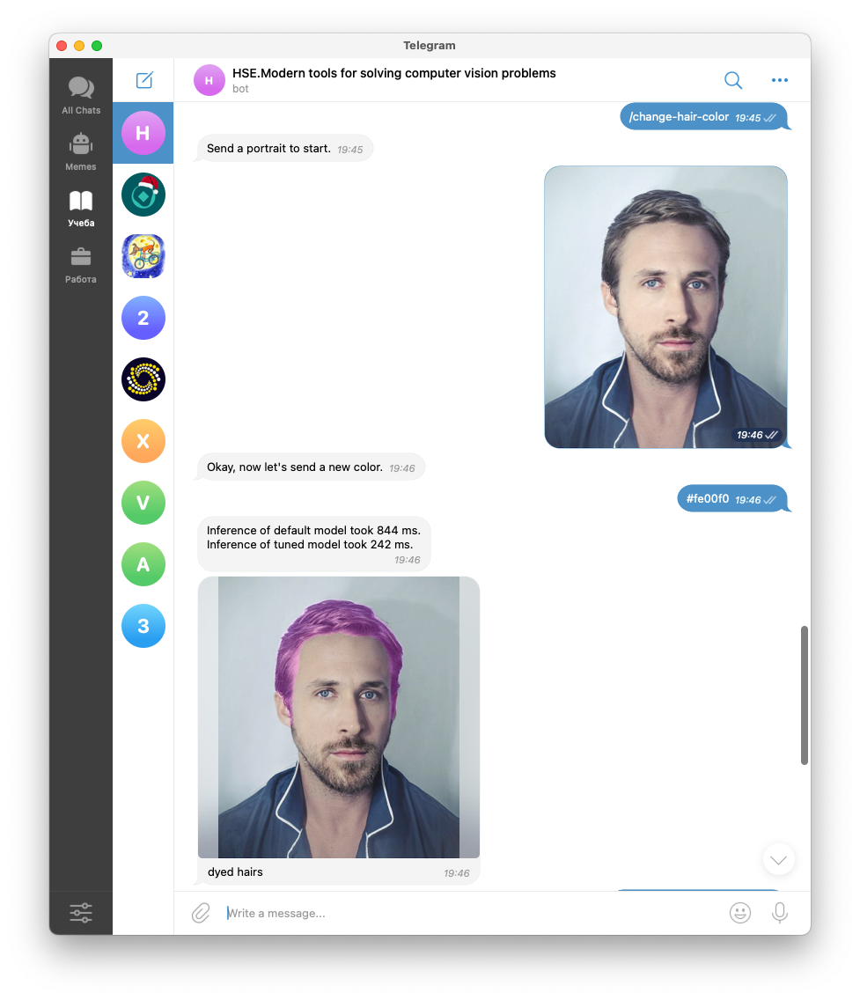
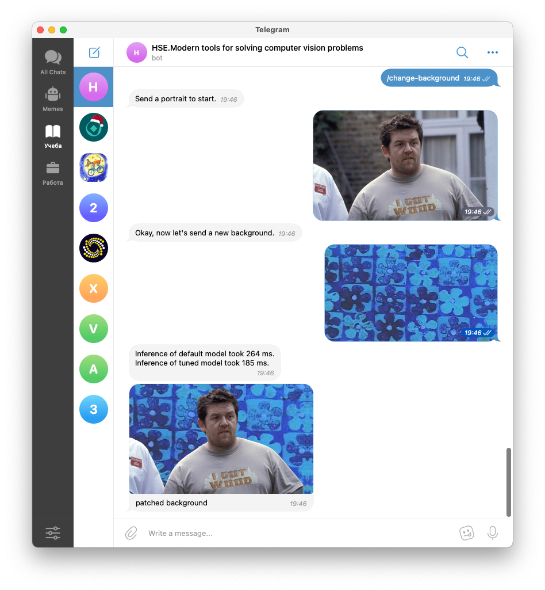

## The model

[The model](https://developers.google.com/mediapipe/solutions/vision/image_segmenter#selfie-model) performs Selfie
segmentation. The model is in TensorFlow Lite format and is stored under [`original_model` folder](./original_model).

The highlights:
- The model expects **normalised** 256x256 RGB image.
- Supports 6 classes: background, hair, body-skin, face-skin, clothes, and accessories.
- Outputs tensor of size 256x256x6

You can see the examples below:

| Original                                | Background                                  | Hair                            |
|-----------------------------------------|---------------------------------------------|---------------------------------|
|  |  |  |

| Body Skin                                 | Face Skin                                 | Clothes                               | Accessories                                   |
|-------------------------------------------|-------------------------------------------|---------------------------------------|-----------------------------------------------|
|  |  |  |  |

## Conversion to TVM

The model has been converted to TVM, then tuned, and exported.
The full results of conversion are included in [`TFLite_Converation.ipynb` notebook file](./utils/TFLite_Convertation.ipynb). 

### Tuning results



### Export

There were 2 option to export the model: 
1. As TVMC package
2. As dynamic library

#### TVMC export

Example of exported model lays under [`tvm_model` folder](./tvm_model) and is called `tvm_not_tuned_selfie_multiclass.tar`.

The issue with TVM is that you need to provide parameters separately, therefore it is required to serialise them and keep
separately. The file with parameters is called [`tvmc_serialised_parameters.npy`](./tvm_model/tvmc_serialised_parameters.npy).

#### Lib.export_library

On the other hand, calling `export_library` allows on compiled `library` allows us to provide baked-in parameters to the library.
For this reason, the approach has been selected.

## Bot

### Example of using the bot 

Bot supports 3 commands:
1. `/segmentation`
2. `/change-hair-color`
3. `/change-background`

#### Segmentation



In the segmentation mode you need to send a selfie in a **quick send** mode.
The result is 6 images corresponding to the classes masks and the original image.

#### Change Hair Color



Changes color of a person depict in the received selfie.
Bot works in 2 steps: firstly, you need to send a selfie and then a hex color value.

#### Change Background



Changes background in selfie, like, modern video call apps are doing.

### Deployment

#### Create an environment file with a bot token

```
cp .env .myenv
```

In the settings file specify the token of your bot obtained from the [`@botfather`](https://t.me/botfather). 

```
TELEGRAM_BOT_TOKEN=0000000000:AAAAAAAAAAAAAAAAAAAAAAAAAAAAAAAAAAA
```

#### Build docker-compose image

`docker-compose --project-name hse_tvm_bot build`

#### Run with environment

`docker-compose --project-name hse_tvm_bot --env-file .myenv up`
