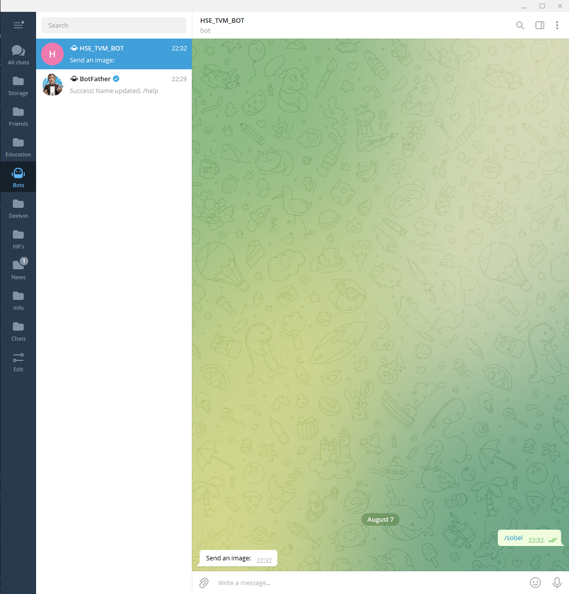
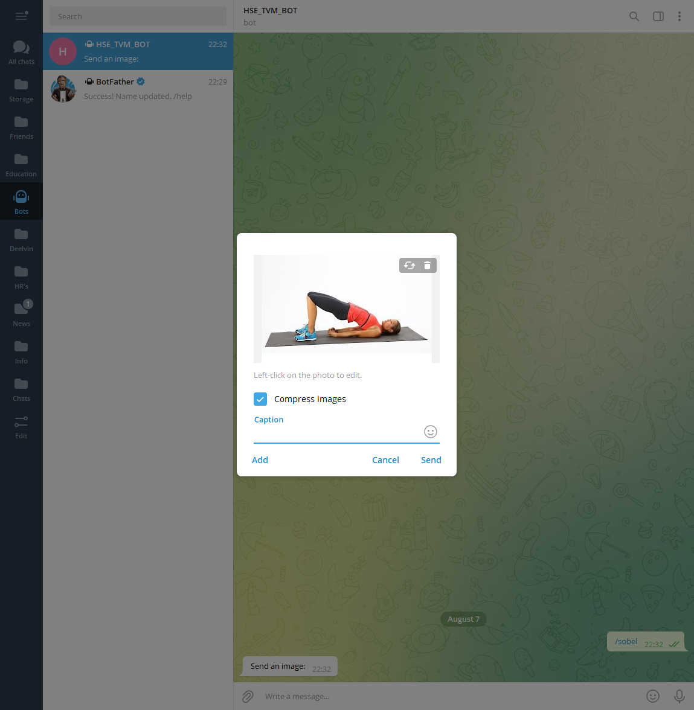
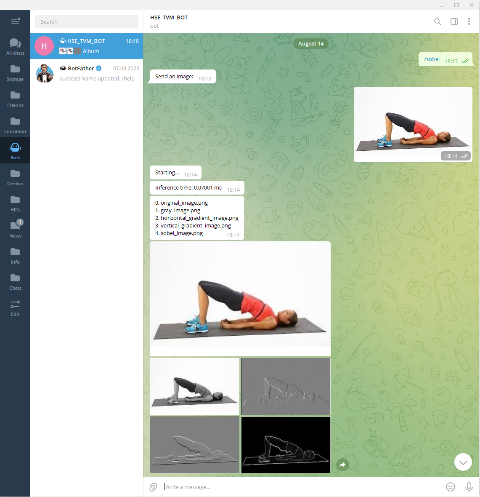

### Create your own settings file for the docker
`cp .env .myenv`
In the settings file specify the token of your bot obtained from @botfather 
> TELEGRAM_BOT_TOKEN=0000000000:AAAAAAAAAAAAAAAAAAAAAAAAAAAAAAAAAAA

### Perform the build
`docker-compose --project-name hse_tvm_bot build`
### Run with your settings
`docker-compose --project-name hse_tvm_bot --env-file .myenv up`

# Example of using the bot 

Enter `/sobel` command

Select and send an image file with the "Compress image" option selected

Look at the results

